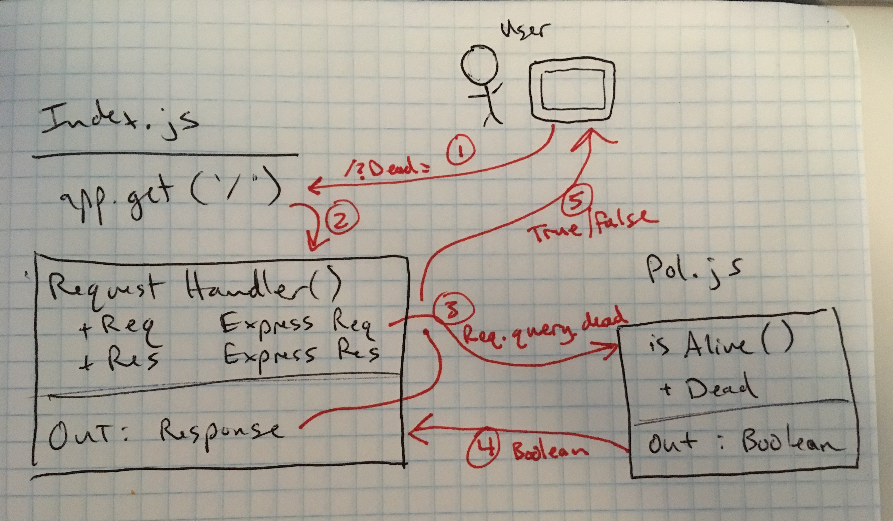

# LAB - 00

## proof of life server

### Author: Dave Trost

### Links and Resources
* [submission PR]()
* [travis]()
* [front-end-web-server](https://dave-class00.herokuapp.com/)

#### Documentation
* [jsdoc](https://dave-class00.herokuapp.com/docs/)

### Modules
#### 'pos.js'
##### Exported Values and Methods

###### isAlive(dead) → {boolean}
Return a boolean value to indicate how the server works

### Setup
#### `.env` requirements
* `PORT=3000`

#### Running the app
* `npm start`
* Endpoint `/`
  * returns a boolean
* Endpoint `/docs`
  * displays JSDoc documentation pages

#### Tests
Unit Tests: `npm test`
Lint tests: `npm run lint`

#### Incomplete tests
N/A

#### UML

